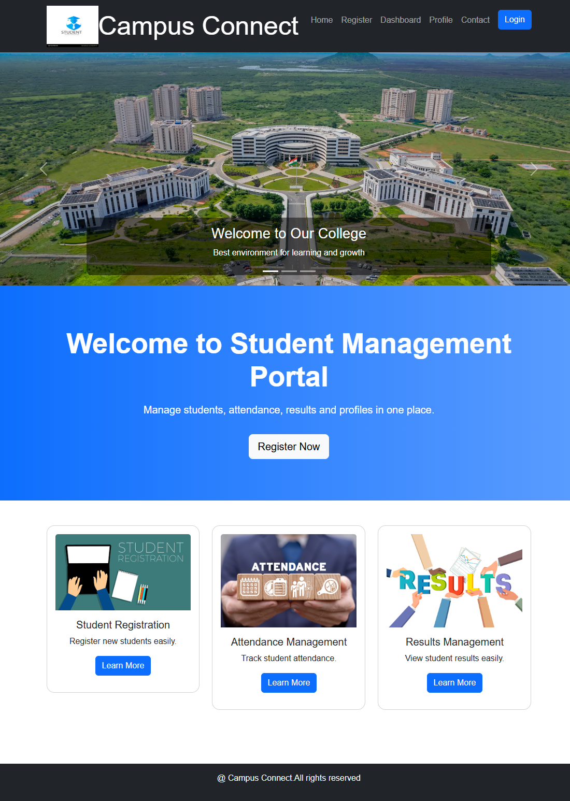
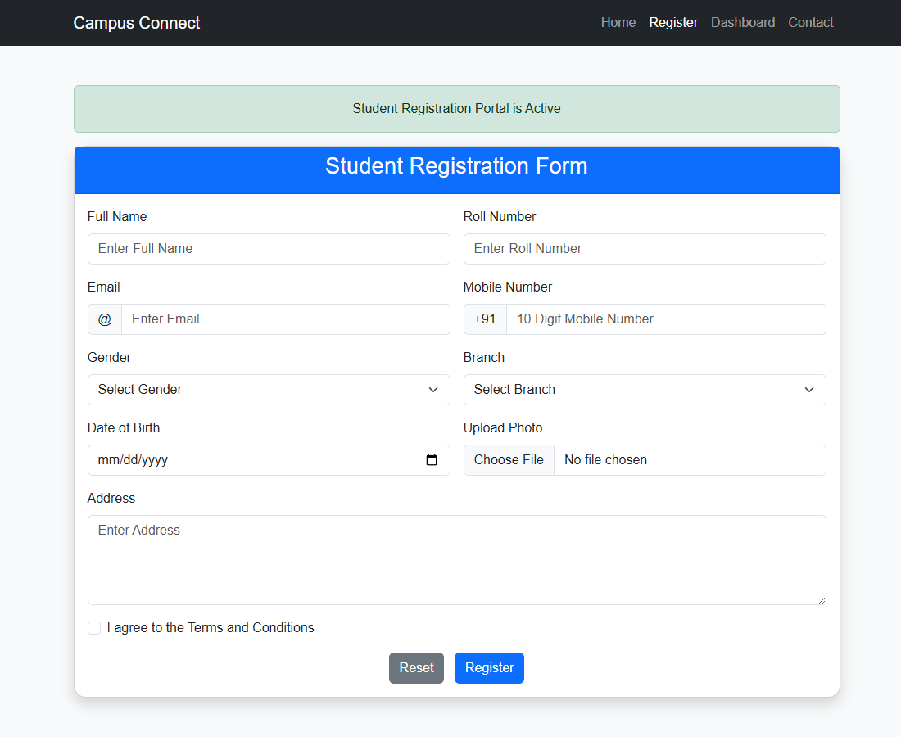
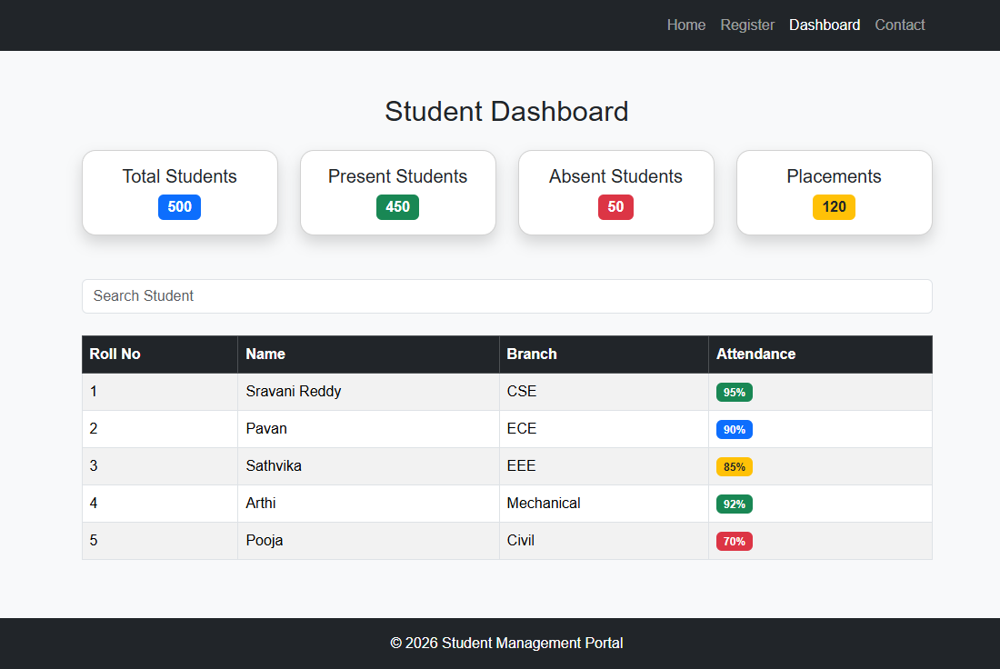
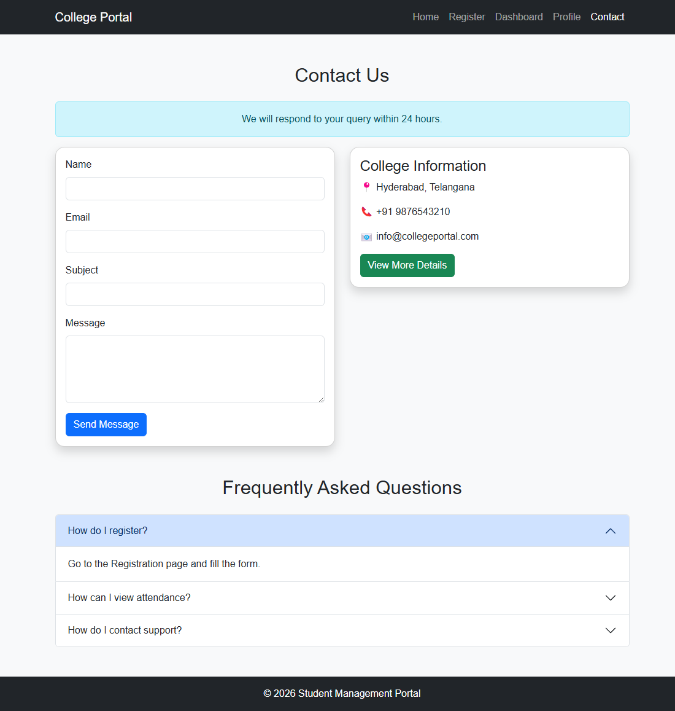
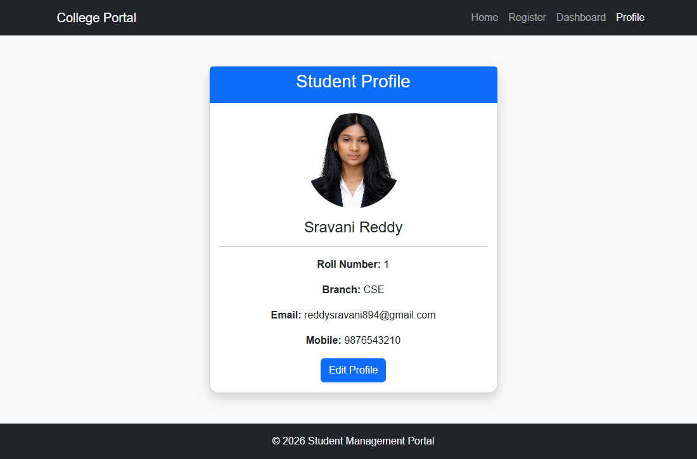

# Student Management Portal

## Project Overview

The Student Management Portal is a responsive web application developed using HTML5, CSS3, and Bootstrap 5. It provides an easy-to-use interface for managing student information, registrations, attendance, profiles, and communication.

The project demonstrates the effective use of Bootstrap components and responsive design principles to ensure compatibility across mobile, tablet, and desktop devices.

---

## Features

### Home Page
- Responsive Navigation Bar
- Carousel Banner
- Hero Section
- Student Services Cards
- Announcements Section
- Modal Popup
- Footer

### Student Registration
- Student Registration Form
- Input Groups
- Form Validation
- File Upload
- Terms and Conditions Checkbox
- Reset and Submit Buttons

### Student Dashboard
- Statistics Cards
- Student Search Bar
- Responsive Student Table
- Attendance Badges

### Student Profile
- Student Information Card
- Profile Image
- Contact Information
- Edit Profile Button

### Contact Us
- Contact Form
- College Information
- Collapse Component
- FAQ Section using Accordion
- Alerts

---

## Technologies Used

- HTML5
- CSS3
- Bootstrap 5

  
---

### Registration Form

### Dashboard

### Contact

### Profile
---

---

## How to Run

1. Download or Clone the repository.
2. Open the project folder.
3. Open `index.html` in a web browser.
4. Navigate through the pages using the navbar.

---

## Future Enhancements

- Database Integration
- Login Authentication
- Student Result Management
- Attendance Tracking System
- Dark Mode Support
- Admin Dashboard

---

## Author

Sravani Reddy

Student Management Portal Project developed using HTML, CSS, and Bootstrap 5.
